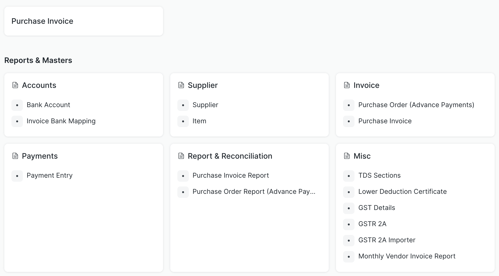
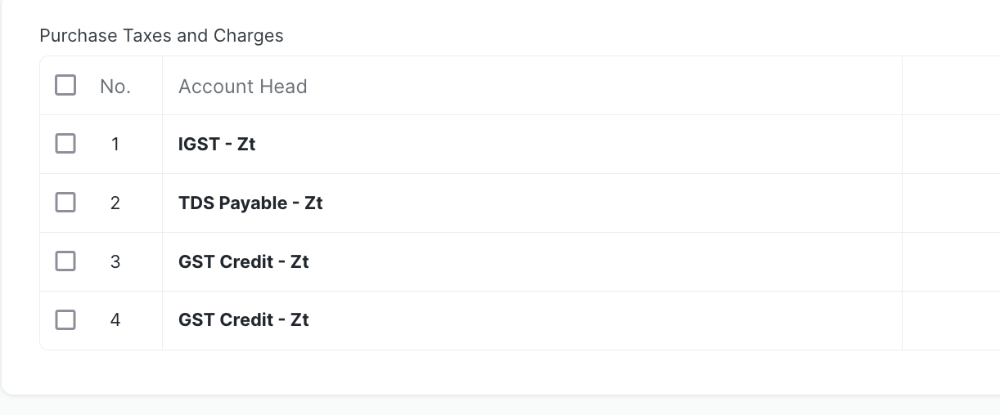
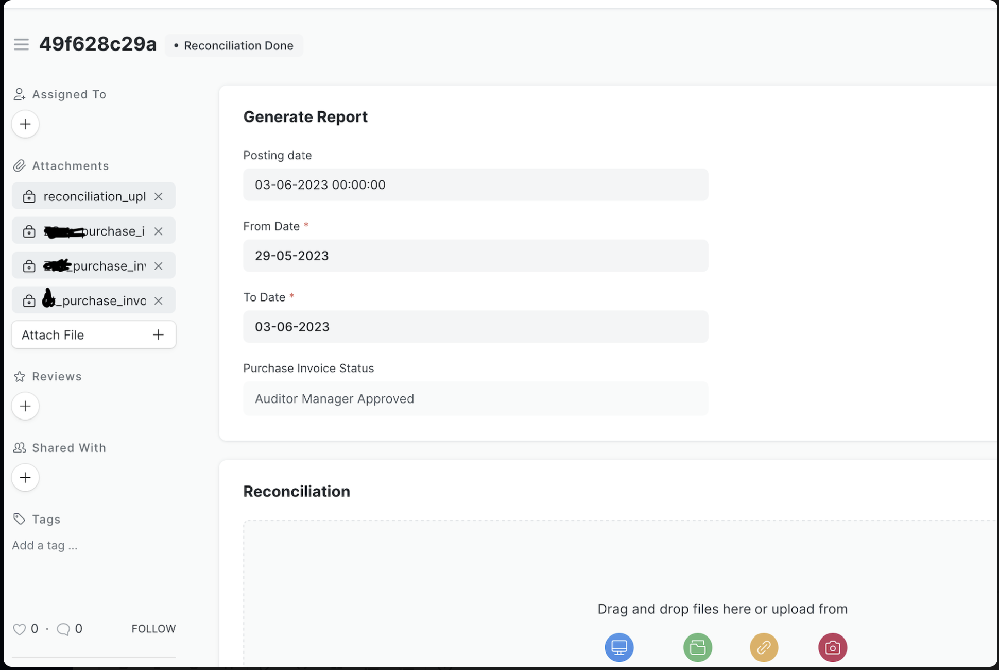

This is an opiniated way of handling vendor payments within a company. This is successfully implemented at zerodha.

## Introduction
Tracking payments that have to be made by a company to its vendors can involve several steps internally within the company. This app helps to make this process easier.

Below is how the workspace of payments looks like with all the necessary tools.

## Workflow

The main component of this is [Purchase Invoice](https://docs.erpnext.com/docs/v13/user/manual/en/accounts/purchase-invoice). The workflow involves multiple steps of Approvals (and Rejections)
To understand how this system works, lets try to understand -

#### Terminology

1. Supplier: A vendor is called supplier here
2. Branch code: IFSC
3. Tax ID: GST Number
4. Purchase Invoice (link): Should be used for a payment
5. Purchase Order (link): Should be used for advance payments
6. Purchase Invoice(file): Invoice file for immediate payment
7. Proforma Invoice(file): Invoice file for an advance payment

#### Actors
   1. Accounts User - The one who creates purchase invoice and uploads related files
   2. Invoice Approver - The one who approves the above entered details/
   3. Accounts Manager - The accounts team who fills in the bank details & taxations of the invoice entered by Accounts User. (Note - these company account related details are only entered by the accounts manager)
   4. Invoice Auditor - A first level audit person who goes through entire details entered so far.
   5. Auditor Manager - A second level auditor who re-checks the entire details entered so far.
   6. Payout - A payouts team who are responsible for downloading the purchase invoice report and uploading reconciliation files once bank payments are done.

#### Sequence

**Approval flow**, i.e if at each step the purchase invoice is approved by the actors then the flow is

Accounts User -> Invoice Approver -> Accounts Manager -> Invoice Auditor -> Auditor Manager -> Payout (download report and then upload reconciliation file)

**Rejection flow**, i.e if at a step the invoice is rejected by an actor, then the flow is

Accounts User <-- Invoice Approver <-- Accounts Manager <-- Invoice Auditor <-- Auditor Manager

### Initial setup to be done

After running `bench migrate` 

1. Set financial year in `Fiscal Year` doctype

2. Accounts creation: For every company present create tds, igst, cgst, sgst accounts
e.g - `IGST - ZSec`, `CGST - ZSec`, `SGST - ZSec`, `TDS - ZSec`, `GST - Credit`

3. Fill in `Company`, `Account`, `Tax Withholding Category`, `Supplier`, `Bank Account`, `GST Details`, `Lower Deduction Certificate` doctype details

4. To send notifications to auditors, you can fill in `Invoice Auditor Notifications`

### Handling TDS, GST, GST Credit Notes, Bank Details

1. TDS

You can pick a TDS category while creating the invoice. You always can check  `TDS Not Applicable` in case of no TDS

2. GST

Pick a GST percentage if applicable. (Tip: While creating GST slabs, have a 0% GST slab too which can be used in cases where GST is not applicable)

3. GST Credit Notes

Sometimes there can be GST credit notes given by the vendor, an optional details which when entered will be considered in final to be paid amount calculation

NOTE: Sometimes a particular vendor can have a Lower Deduction Certificate for GST, in such cases, for an invoice with this vendor, final to be paid amount calculation will be accordingly handled given the certificate details are entered in the `Lower Deduction Certificate` doctype

4. Bank Details

These are pre-filled in Account Manager Step and can be edited. 
In case of multiple bank accounts to the same vendor, the account manager can pick the right bank details from the list

In Purchase Taxes and Charges table this is how it will appear

### Reports and Reconciliation

To get a report of all the purchase invoice to which payments have to be made, steps -

1. Go to `Purchase Invoice Report` and make an entry

2. You can then download the report file from left side file section.
(If you have multiple companies from which vendors are paid depending on the invoice, then in this report you will see multiple files getting created on company basis)

downloaded report file columns - `N,a,account_no,amount,vendor_name,b,c,d,e,f,g,h,i,bank_narration,j,k,l,m,n,o,p,q,date,r,ifsc,bank_name,bank_branch,client_email`

where `a,b,c,d,e..q` are just empty columns and
`bank_narration` is an unique id for every purchase invoice, that can be used to idenify an invoice in the system

3. After bank payments are made, a reconciliation file in the below format is uploaded to mark the invoice entry as Paid 

reconciliation file columns- `date,Bank naration ,amount,reference number`

### Handling Auditors

Sometimes auditors can be a external team completely different from internal company employees, in such cases to handle their login seperately in the system, update [this line](https://github.com/zerodha/vendor-payments/blob/master/vendor_payments/api/login.py#L21) after creating a `Social Login Key` for them

## Reminders

To send reminder emails after x days of workflow updates call via a cron or some scheduler this below command

`bench execute vendor_payments.vendor_payments.reminders.payments_reminder`

Two types of reminder emails are included as of now
	
1. A reminder email is sent after two days of a purchase invoice or order entry creation. Depending on the state of the entry, emails are sent to respective persons
2. After an entry status is updated to ‘Auditor Approved’, a reminder email is sent after two days if it is not updated to ‘Payment Done’ from the date of ‘Auditor Approved’ status.

## Non Profit Organizations

1. For handling grant applications as a non profit organization:

   please check [Non profit module](https://docs.erpnext.com/docs/v13/user/manual/en/non_profit/introduction) on erpnext 

   check installation [here](https://github.com/frappe/non_profit)

2. Handling payments for an NGO or any organizations that doesn't have taxations:

   Sometimes there can be payments to which there is no TDS or GST, in such cases if - 
   1) No TDS - check `TDS Not Applicable`
   2) NO GST - Pick a 0% GST slab (Tip - create a 0% GST in GST Details doctype)

## Known possible errors

1. If you face errors like `Reference No and Reference Date is mandatory for Bank transaction`

   update payment mode of all 'Accounts' to cash (Except for payable account types)
## TODO

Advancements payments workflow and its report

`Purchase Order` of ERPNext will be used for this

## Contributors

- [Nikhil Ponnuru](https://github.com/nikhilponnuru)

## LICENSE

[LICENSE](./LICENSE)